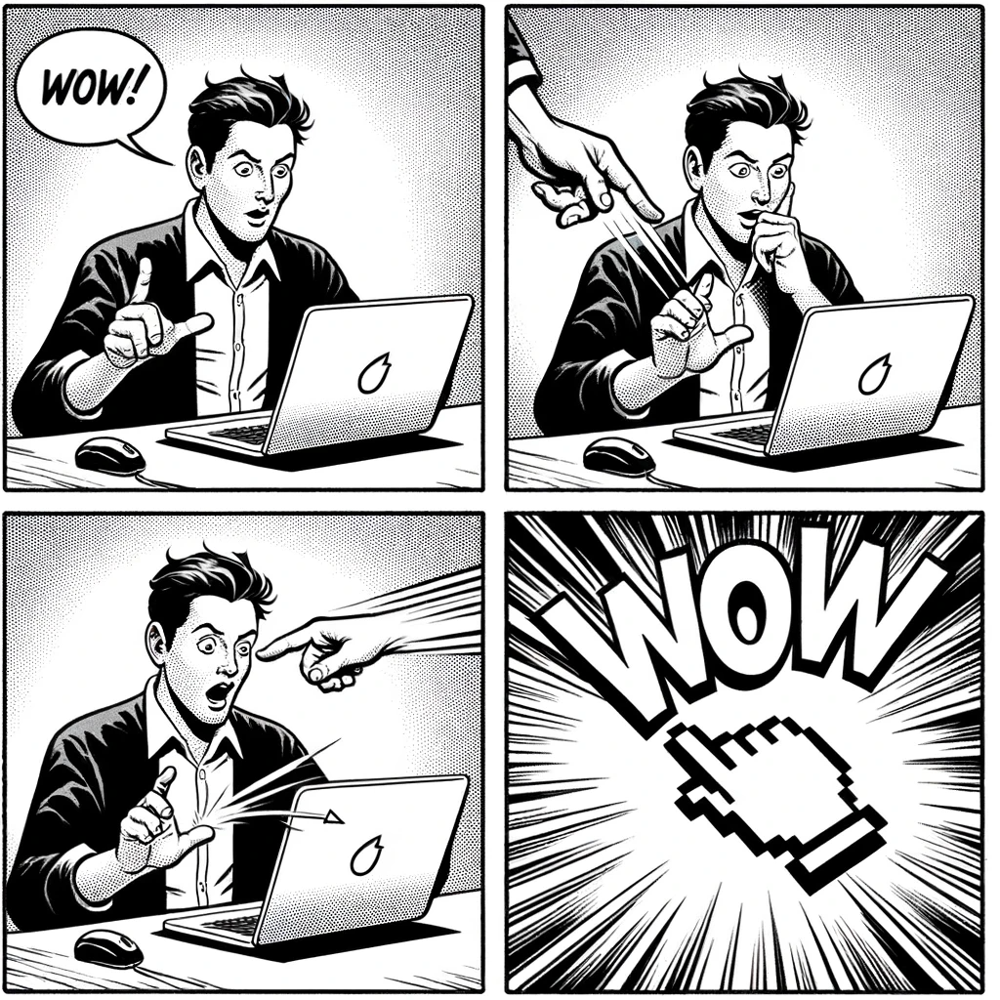

# Gesture Description

## 製品概要
ウェブカメラ1つで空中の手の動きを捉え、PC上に絵を描くことができます。

### 背景(製品開発のきっかけ、課題等）
- タッチパッドを操作せずに、描画したい
- 非接触操作の重要性の増加

### 製品説明（具体的な製品の説明）
ウェブカメラにより、人差し指を認識して、空中に描いた絵をPC上に反映させます。

### 特長
#### 1. 簡単なセットアップ
ウェブカメラがあればすぐに利用開始できます。
#### 2. 直感的な操作
学習曲線がほぼなく、直感的に利用できます。マウスのサイドボタンにない直感性が魅力です。
#### 3. カスタマイズ可能
利用者の好みに応じて、ジェスチャーとショートカットをカスタマイズ可能です。拡張性も備えています。

### 解決出来ること
- キーボードを頻繁に利用することなく、基本的な操作を行えます。
- 非接触での操作が可能となり、衛生的です。

### 今後の展望
- より多くのジェスチャーの認識
- 他のデバイスとの連携

### 注力したこと（こだわり等）
* 高精度のジェスチャー認識
* ユーザーフレンドリーなインターフェース

## 開発技術
### 活用した技術
#### API・データ
* MediaPipe
* OpenCV

#### フレームワーク・ライブラリ・モジュール
* TensorFlow
* PyAutoGUI

#### デバイス
* 一般的なウェブカメラ

### 独自技術
#### ハッカソンで開発した独自機能・技術
* 独自で開発したものの内容をこちらに記載してください
* 特に力を入れた部分をファイルリンク、またはcommit_idを記載してください。

#### 製品に取り入れた研究内容（データ・ソフトウェアなど）（※アカデミック部門の場合のみ提出必須）
* 
* 
