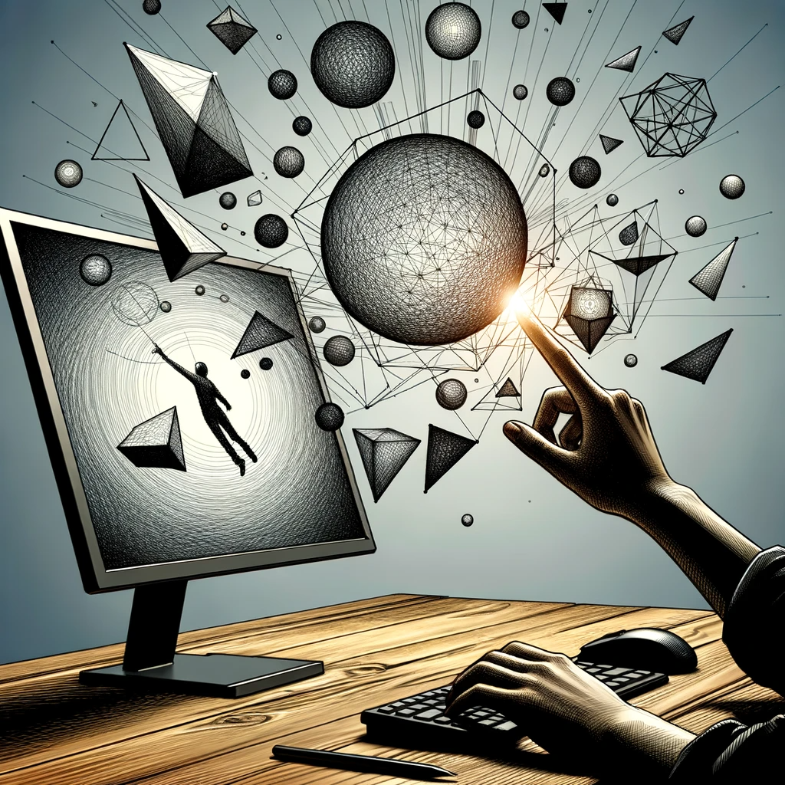

# Finger Drawing

## 製品概要
ウェブカメラ1つで空中の手の動きを捉え、ディスプレイ上に絵を描くことができます。

### 背景(製品開発のきっかけ、課題等）
- タッチパッドを操作せずに、描画したい
- iPadや液晶タブレットなどのデバイスに依存せずに、高精度な絵を描きたい

### 製品説明（具体的な製品の説明）
ウェブカメラにより、人差し指を認識して、空中に描いた絵をディスプレイ上に反映させます。

### 特長
#### 1. 簡単なセットアップ
ウェブカメラがあればすぐに利用開始できます。
#### 2. 直感的な操作
PCのタッチパッドを使用せずに描くことができるので、あたかも画面に直接描くような感覚で使用することができます。

### 解決出来ること
- タッチパッドを使用せずに、直感的に描くことができます。
- iPadや液晶タブレットなどの外部デバイスが不要です

### 今後の展望
- 消しゴム機能の実装
- 2人以上で共同作業
- 線の太さや色を自在に変えたい
- 他デバイスとの連携、または他デバイスでも同じような機能を実装したい。(スマホ、タブレットなど)

### 注力したこと（こだわり等）
* 高精度のポインター認識
* どこを指しているのかわかりやすい

## 開発技術
### 活用した技術
#### API・データ
* MediaPipe
* OpenCV

#### フレームワーク・ライブラリ・モジュール
* mediapipe
* opencv-python
* tensorflow
* scikit-learn
* matplotlib
* protobuf

#### デバイス
* 一般的なウェブカメラ

### 独自技術
#### ハッカソンで開発した独自機能・技術
* 

#### 製品に取り入れた研究内容（データ・ソフトウェアなど）（※アカデミック部門の場合のみ提出必須）
* 
* 
